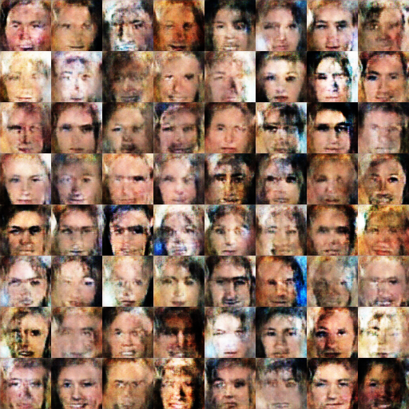
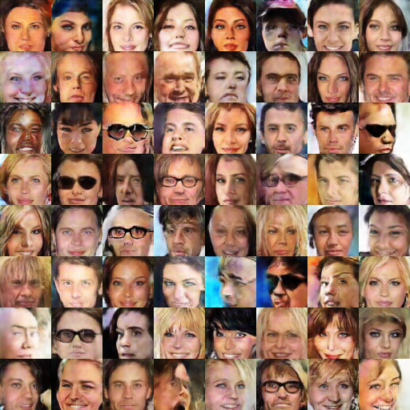

## WassersteinGAN

TensorFlow implementation of [Wasserstein GAN](https://arxiv.org/abs/1701.07875)  

Other implementations:
- [Torch (Author's)](https://github.com/martinarjovsky/WassersteinGAN)  
- [Chainer](https://github.com/hvy/chainer-wasserstein-gan)  
- [Keras](https://github.com/tdeboissiere/DeepLearningImplementations/tree/master/WassersteinGAN)  
  

DCGAN model/ops are a modified version of Taehoon Kim's implementation [@carpedm20](https://github.com/carpedm20/DCGAN-tensorflow).

- - -
### Usage

Download dataset:
```bash
python download.py celebA
```
To train:
```bash
python main.py --dataset celebA --is_train --is_crop
```
OR modify and use `run.py`:
```bash
python run.py
```

**Note:** a NumPy array of the input data is created by default. This is to avoid batch by batch IO. 
You can turn this option off if the available memory is too small on your system or if your dataset is too large.
```bash
python main.py --dataset celebA --is_train --is_crop --preload_data False
```

- - - 
### Results
My experiments show that training with a Wasserstein loss is much more stable than the conventional heuristic loss <a href="https://www.codecogs.com/eqnedit.php?latex=$-\log{D}$" target="_blank"></a>. However, the generated image quality is much lower. See examples below.

The architectures of the generator and discriminator (critic) is the same in 
both experiments. For cross-checking purposes here are the things that are
different:  
1. Batch Normalization parameters: epsilon = 1e-3 (1e-5), momentum = 0.99 (0.9) for Wasserstein (Heuristic).  
2. RMSProp (Adam) for Wasserstein (Heuristic).  

#### Wasserstein Loss
Sample images after 50 epochs:  


#### Heuristic Loss
Sample images after 25 epochs using loss <a href="https://www.codecogs.com/eqnedit.php?latex=$-\log{D}$" target="_blank"></a>:  

